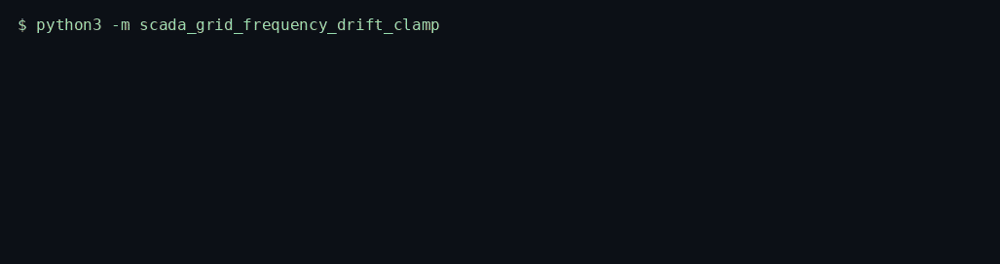
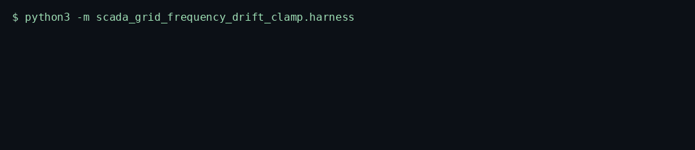
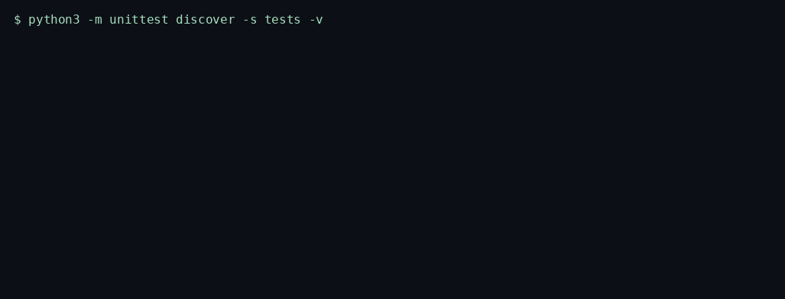

# SCADA Grid Frequency Drift Clamp

> Smooths a 60 Hz series, computes rate of change, and publishes a clamped value when frequency or RoCoF leaves its band. It never writes a control.

<p>
  <a href="https://github.com/TechieGoku2623/scada-grid-frequency-drift-clamp/actions/workflows/ci.yml"></a>
  
  
</p>

| | |
| --- | --- |
| **Website** | https://github.com/TechieGoku2623/scada-grid-frequency-drift-clamp |
| **Topics** | `python` `asyncio` `smart-grid` `scada` `frequency` `telemetry` |

## Walkthrough

Three recordings from this repository. Each one is the command in the frame, not a drawing.

### Engine

`python3 -m scada_grid_frequency_drift_clamp`



NaN raises. A step that implies an impossible RoCoF is clamped and counted, not followed.

### Benchmark

`python3 -m scada_grid_frequency_drift_clamp.harness`



5000 in-band samples, seed 20261002. The frame ends on the status line and `echo $?`.

### Tests

`python3 -m unittest discover -s tests -v`



Wire round-trip, the happy path, and both edge cases below.

## Pipeline

```
Hz sample
  |
  v
f_hat += alpha * (f - f_hat)
  |
  v
RoCoF = (f_hat - previous) / 0.1 s
  |
  +--> inside deadband --> publish f_hat
  +--> outside ----------> publish clamp, WARNING
  v
{published_hz, rocof_hz_s, clamps, rejected}
```

## Quick start

```bash
python3 -m venv venv
source venv/bin/activate
pip install -e ".[dev]"
python -m scada_grid_frequency_drift_clamp
python -m scada_grid_frequency_drift_clamp.harness
python -m unittest discover -s tests -v
```

Python 3.12. The runtime is the standard library. `black` and `flake8` are the `dev` extra.

## Use it

```python
import asyncio

from scada_grid_frequency_drift_clamp import ScadaGridFrequencyDriftClamp


async def demo() -> None:
    engine = ScadaGridFrequencyDriftClamp()
    result = await engine.run([60.0, 60.01, 60.2])
    print(result)


asyncio.run(demo())
```

## Bounds

| | |
| --- | ---: |
| Iterations | 5000 |
| Average | 389.093 µs |
| P99 | 521.961 µs |
| tracemalloc peak | 554188 bytes |

Figures are from the harness on the machine that published them. A later host moves the microseconds. The pass/fail result does not.

## What it refuses

- A NaN sample raises `EngineKernelException` and is not published.
- A step past the hard RoCoF ceiling is clamped to the band and counted. The raw step is not emitted.

Aligned with NERC CIP monitoring of BES telemetry integrity. This process does not speak a field protocol.

## Tree

```
src/scada_grid_frequency_drift_clamp/
  engine.py       kernel
  wire.py         struct frames
  harness.py      benchmark
  __main__.py     demo entry
tests/test_engine.py
Dockerfile        non-root, uid 10001
```
